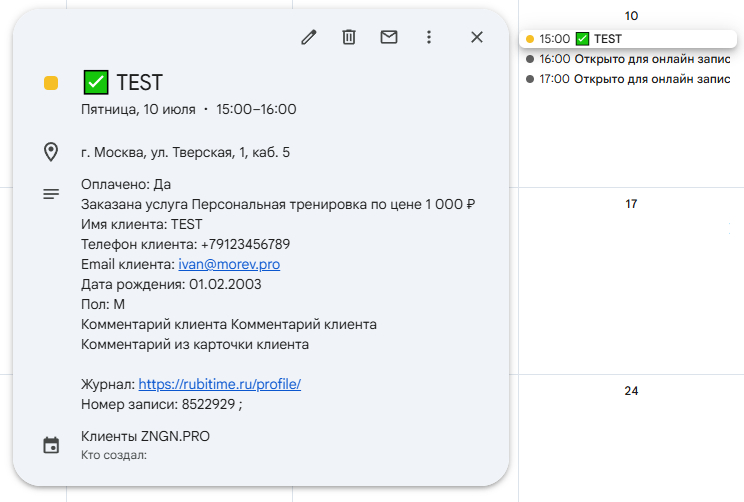

# Rubitime → Google Calendar

[](https://unlicense.org/)
[](https://www.python.org/downloads/)
[](https://www.docker.com/)
[](https://fastapi.tiangolo.com/)

FastAPI-сервис для синхронизации записей Rubitime с Google Calendar.

Сервис принимает webhook-события от Rubitime и синхронизирует их с Google Calendar. Дополнительно реализован фоновый синхронизатор, который раз в 5 минут опрашивает Rubitime API на наличие свободных слотов и публикует их в Google Calendar как события с признаком доступности.



## 🚀 Быстрый старт

### Требования

- Docker и Docker Compose
- Google Cloud account с доступом к Calendar API
- Аккаунт в Rubitime

### Настройка

1. **Получите API ключ Rubitime**
   - Инструкция: [Rubitime API FAQ](https://rubitime.ru/faq/api)

2. **Настройте Google Calendar**
   - Получите `GOOGLE_CALENDAR_ID` (формат: `xxxx@group.calendar.google.com`)
   - Создайте сервисный аккаунт в Google Cloud Console:
     - [Официальная инструкция Google](https://developers.google.com/workspace/guides/create-credentials#create_credentials_for_a_service_account)
     - [Неофициальный гайд](https://docs-pulse.edna.ru/docs/additional-info/push/get-json)

3. **Создайте `.env` файл**
   ```bash
   cp .env.example .env
   ```
   Заполните переменные окружения, описанные в разделе [Переменные окружения](#переменные-окружения)

4. **Разверните приложение**
   ```powershell
   docker-compose down
   docker system prune -f
   docker-compose up --build
   ```

5. **Настройте webhook в Rubitime**
   - Укажите URL вашего сервера (например, `https://your-domain.com/webhook`)
   - Подключите webhook к нужному филиалу

---

## Endpoints

| Метод | Endpoint | Описание |
|-------|----------|----------|
| `GET` | `/health` | Проверка работоспособности сервиса |
| `POST` | `/webhook` | Получение событий от Rubitime |

---

## Конфигурация

### Переменные окружения

| Переменная | Обязательна | По умолчанию | Описание |
|------------|-------------|--------------|----------|
| `GOOGLE_CALENDAR_ID` | ✅ | — | ID календаря вида `xxxx@group.calendar.google.com` |
| `GOOGLE_SERVICE_ACCOUNT_JSON_FILE` | ✅ | — | Путь к файлу JSON ключа сервисного аккаунта Google |
| `RUBITIME_API_KEY` | ✅ | — | API ключ Rubitime |
| `RUBITIME_BRANCH_ID` | ✅ | — | ID филиала (должен быть > 0) |
| `RUBITIME_COOPERATOR_ID` | ✅ | — | ID сотрудника (должен быть > 0) |
| `RUBITIME_SERVICE_ID` | ✅ | — | ID услуги (должен быть > 0) |
| `RUBITIME_ONLY_AVAILABLE` | ❌ | `false` | `true` для выбора только свободных слотов |
| `RUBITIME_SYNC_INTERVAL_SECONDS` | ❌ | `300` | Интервал опроса Rubitime в секундах (минимум 60) |
| `EVENT_TIMEZONE` | ❌ | `Europe/Moscow` | Часовой пояс событий |
| `EVENT_LOCATION` | ❌ | — | Адрес по умолчанию для события |
| `GOOGLE_EVENT_COLOR_ID` | ❌ | `5` | Цвет события в Google Calendar |
| `CALENDAR_SUMMARY_TEMPLATE` | ✅ | — | Шаблон названий событий |
| `LOG_LEVEL` | ❌ | `INFO` | Уровень логирования (`INFO` или `DEBUG`) |
| `APP_HOST` | ❌ | `0.0.0.0` | Хост для локального запуска |
| `APP_PORT` | ❌ | `8000` | Порт для локального запуска |

---

## Синхронизация свободных слотов

### Алгоритм работы

1. **Периодический опрос** — каждые 5 минут сервис опрашивает Rubitime API на наличие свободных слотов
2. **Полная замена** — удаляются все старые события свободных слотов и создаются новые (без частичных обновлений)
3. **Создание событий** — для каждого свободного слота создается событие длительностью 1 час

### Поведение событий свободных слотов

- **Длительность**: 1 час
- **Статус занятости**: `transparent` (не занятое время)
- **Статус события**: `tentative` (предварительный)
- **Цвет**: `Graphite` (цвет 8)
- **Название**: `Открыто для онлайн записи`
- **Метка**: `rubitime_slot_type=available` в `extendedProperties.private`
- **ID формат**: `availYYYYMMDDHHMM` (например, `avail202607081800`)

> **Важно**: ID событий свободных слотов используют только символы `a-v` и `0-9` (требование Google Calendar API).

---

## Webhook от Rubitime

Сервис принимает webhook-события по спецификации [Rubitime API](https://morevpro.github.io/rubitime-api/#/Webhooks).

### Поддерживаемые события

- `event-create-record` — создание новой записи
- `event-update-record` — обновление существующей записи
- `event-remove-record` — удаление записи

### Требования к payload

- Обязательные поля: `event`, `data`, `data.id`
- Числовые поля (`price`, `status`, `duration`) принимаются как строки и как числа

### Поведение

| Событие | Действие |
|---------|----------|
| `event-create-record` | Создание/обновление события в Google Calendar |
| `event-update-record` | Создание/обновление события в Google Calendar |
| `event-remove-record` | Удаление события из Google Calendar |

**Особенности:**

- Email клиента **не добавляется** в участники события (ограничения Google Calendar), но сохраняется в описании
- Название события строится на основе шаблона `CALENDAR_SUMMARY_TEMPLATE`
- В описание добавляются: данные записи, информация о клиенте, услуга, цена, комментарии и ссылка на журнал

---

## Запуск локально (без Docker)

### Требования

- Python 3.8+
- pip

### Установка и запуск

```bash
# Установите зависимости
pip install -r requirements.txt

# Создайте файл .env
cp .env.example .env
# Отредактируйте .env с вашими настройками

# Запустите сервер
uvicorn app.main:app --host 0.0.0.0 --port 8000 --reload
```

---

## Диагностика

### Проверка работоспособности

```bash
curl http://localhost:8000/health
```

**Ожидаемый ответ:**
```json
{"ok": true}
```

### Тест webhook

```bash
curl --request POST \
  --url http://127.0.0.1:8000/webhook \
  --header 'content-type: application/json' \
  --data '{
    "event": "event-update-record",
    "data": {
      "id": 12345,
      "record": "2026-01-15 14:00:00",
      "name": "Lorem Ipsum",
      "phone": "+79991234567",
      "email": "lorem.ipsum@dolor.com",
      "status": 0,
      "status_title": "Записан",
      "branch_title": "Клиника",
      "service_title": "Услуга",
      "url": "https://example.com/widget/abc123"
    }
  }'
```

**Ожидаемый ответ:**
```json
{
  "ok": true,
  "accepted": true,
  "record_id": 12345,
  "event": "event-update-record"
}
```

### Просмотр логов

```bash
docker-compose logs -f app
```

### Ожидаемые логи

```
rubitime_scheduler_started          # Планировщик запущен
rubitime_schedule_sync_started      # Начало синхронизации
rubitime_schedule_slots_parsed      # Количество найденных слотов
rubitime_slot_created               # Создание слота (DEBUG)
rubitime_schedule_sync_finished     # Синхронизация завершена
```

### Типичные проблемы

#### Слоты не создаются

**Симптом**: В календаре нет событий "Открыто для онлайн записи"

**Решение**:
1. Проверьте переменные `RUBITIME_BRANCH_ID`, `RUBITIME_COOPERATOR_ID`, `RUBITIME_SERVICE_ID` (> 0)
2. Убедитесь в валидности `RUBITIME_API_KEY`
3. Проверьте логи на наличие `rubitime_schedule_not_configured`
4. Убедитесь, что в Rubitime есть свободные слоты

#### Ошибка 403 Google Calendar

**Симптом**: `rubitime_slot_creation_failed` с `HttpError 403`

**Решение**:
1. Проверьте разрешения сервисного аккаунта в Google Cloud Console
2. Убедитесь, что Calendar API включен для проекта

#### Ошибка 400 "Invalid resource id value"

**Симптом**: `rubitime_slot_creation_failed` с `HttpError 400`

**Причина**: Неверный формат ID события (используется подчёркивание)

**Решение**:
1. События свободных слотов теперь используют ID формата `availYYYYMMDDHHMM`
2. При следующем синке старые события будут удалены и созданы новые

---

## Логирование

Для подробного логирования установите `LOG_LEVEL=DEBUG` в `.env`:

```
rubitime_slot_created   # Детали каждого созданного слота
rubitime_slot_deleted   # Детали каждого удалённого слота
```

---

## Структура проекта

```
rubitime-gcal-integration/
├── app/
│   ├── __init__.py
│   ├── config.py           # Конфигурация приложения
│   ├── main.py             # Точка входа (FastAPI)
│   ├── models/             # Модели данных Pydantic
│   ├── routes/             # API endpoints
│   └── services/           # Бизнес-логика
├── Dockerfile
├── docker-compose.yml
├── requirements.txt
├── .env.example            # Пример конфигурации
└── README.md
```


## Заметки

- Event IDs свободных слотов имеют префикс `avail` и используют только символы `a-v` и `0-9` (требование Google Calendar API)
- Сервис использует полную замену событий свободных слотов при каждой синхронизации
- Email клиентов не добавляются в участники событий из-за ограничений Google Calendar API

---
